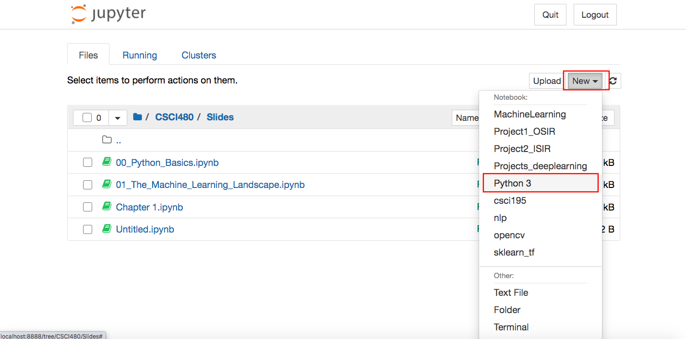
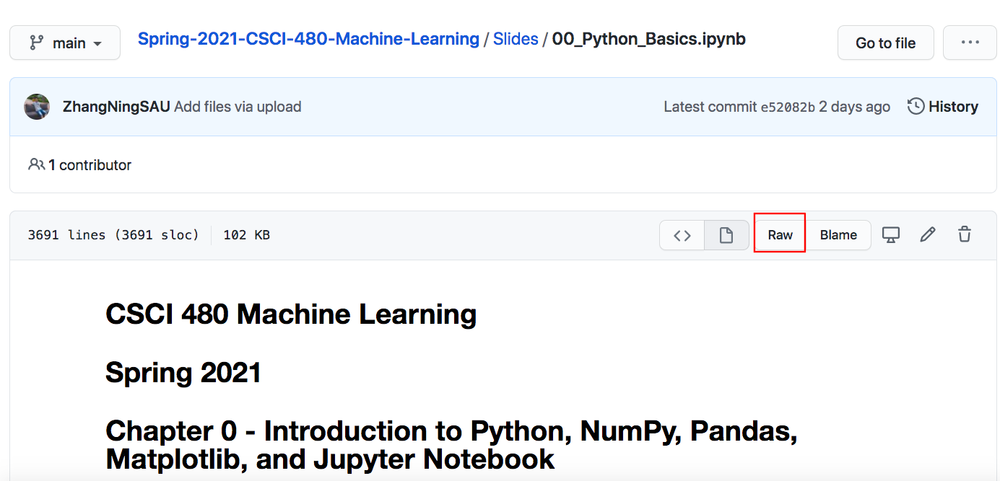
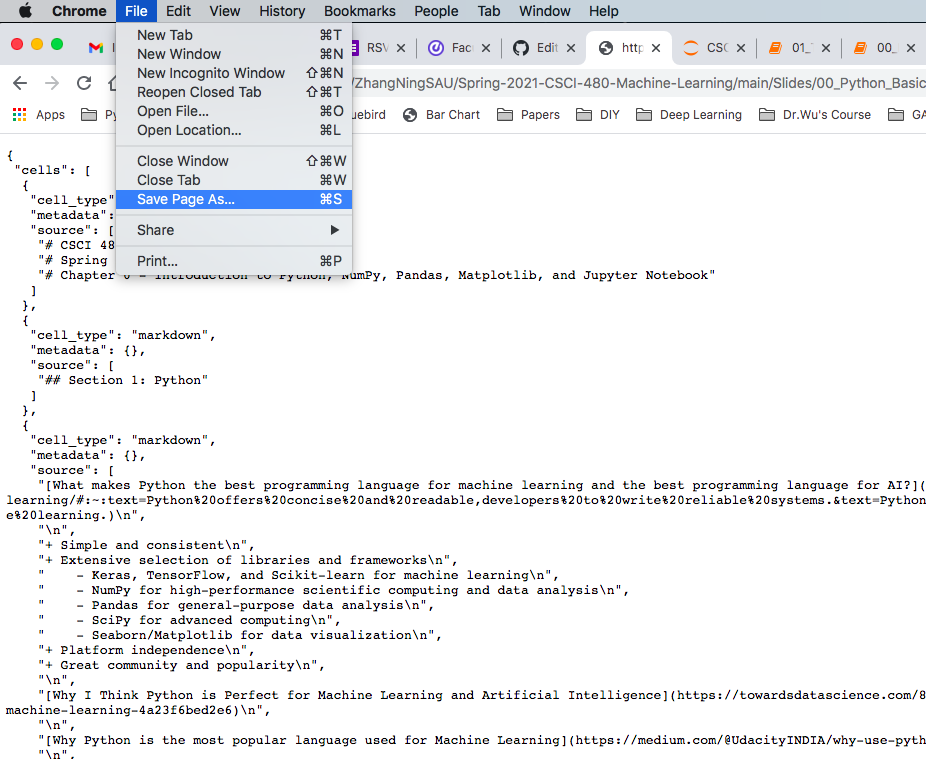
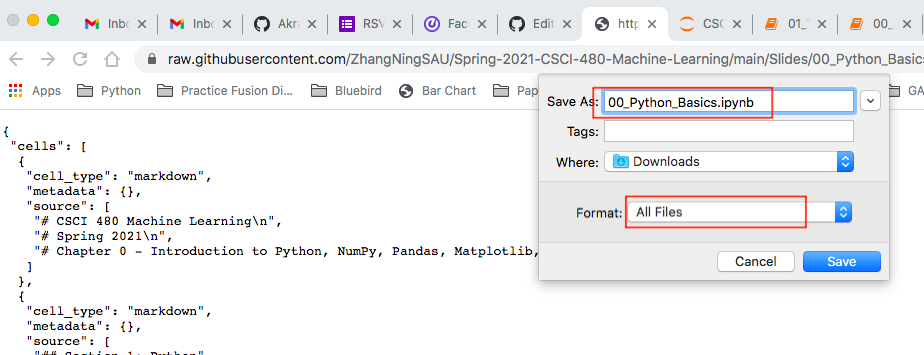
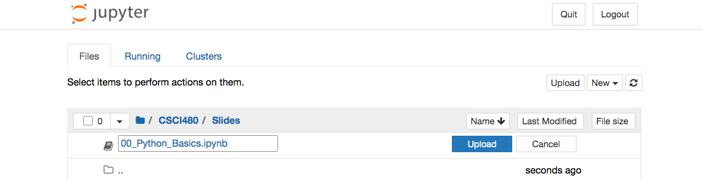
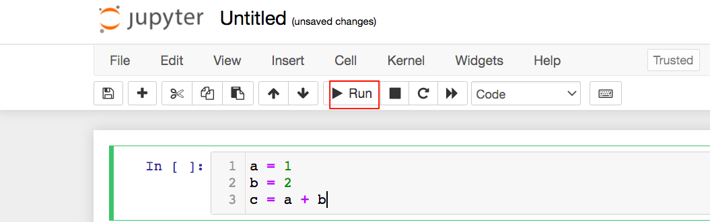
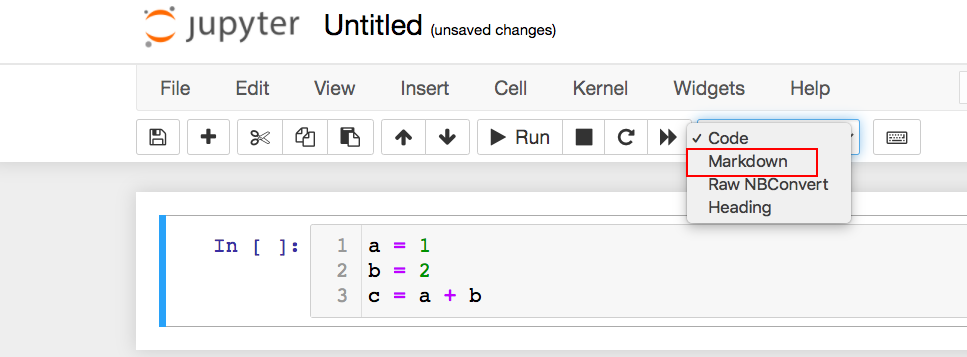

# CSCI480 Spring 2021
# Homework 0
# Due: ASAP
# Q1: Install Python
+ One tutorial link was provided in Section 1, [Chapter 0](https://github.com/ZhangNingSAU/Spring-2021-CSCI-480-Machine-Learning/blob/main/Slides/00_Python_Basics.ipynb).
# Q2: Install Jupyter Notebook
+ One tutorial link was provided in Section 2, [Chapter 0](https://github.com/ZhangNingSAU/Spring-2021-CSCI-480-Machine-Learning/blob/main/Slides/00_Python_Basics.ipynb).

Note: If the content of jupyter notbook file **00_Python_Basics.ipynb** does not show up, you can use the nbview to see it. Here is the link to nbview. https://nbviewer.jupyter.org/

# Q3: Create a ipynb file

Note: 
+ When you click on **New**, you will see a list of kernels. Python3 is the default kernel, while others are user-defined. For example, MachineLearning is the one I defined for this course. You just need to choose the default one: Python3. 

+ If you need to download and use the ipynb files(the lecture slides), you can
  - go to https://github.com/ZhangNingSAU/Spring-2021-CSCI-480-Machine-Learning/tree/main/Slides
  - choose the file you need to download, for example 00_Python_Basics.ipynb
  - click on Raw
  
  
  
  - save the file
    + You can also use shortcut ctrl+s(windows) or cmd+s(mac)
    + Use the correct file extension ipynb instead of txt
    + Use the correct format All Files instead of text
    + If you know how to install and use command **wget**, you can use the following command at the Terminal (Mac/Linux) or Command Prompt (Windows)(use the url of the raw file).
    ~~~~~
    wget https://raw.githubusercontent.com/ZhangNingSAU/Spring-2021-CSCI-480-Machine-Learning/main/Slides/00_Python_Basics.ipynb
    ~~~~~
  
  
  
  
  
  - open the file
    + Of course, you can move the downloaded file into the jupyter notebook folder(which is not that easy to locate).
    + We have a much simpler way: Drag the file to web browser(the main web page - the page that was launched when you run **Jupyter Notebook**)
    
    
  
# Q4: In the ipynb file you crtead in Q3, try the code related to
  + Python basics
  + Numpy
  + Pandas
  + Matplotlib
Note:
+ you need to install the packages before use them. Use the following commands in the CLI.
  - pip install numpy
  - pip install pandas
  - pip install matplotlib
+ To run the current cell, click on Run or use shortcut Shift+Enter
  - [other jupyter notebook shortcuts](https://towardsdatascience.com/jypyter-notebook-shortcuts-bf0101a98330)

+ Cells are for code by default, if you need to provide markdown(text), change it to Markdown.
  - [Markdown Tutorial](https://guides.github.com/features/mastering-markdown/)
 

# Step 1: Finish Q1-Q4
# Step 2: No submission. If you have any questions, you can email me (better attach some screenshots) or set up an WebEx meeting.
