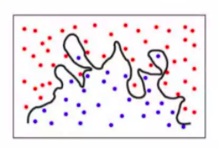

# CSCI480 Spring 2021
# Homework 1
# Due: 11:59pm 02/15/2021

Q1. Do your research on Deep Blue (the chess computer), explain why the method Deep Blue used is **NOT** a machine learning approach? 

Q2. Given a dataset of customers(for example, name, age, gender, purchased products...), if you need to find the similarities 
in customers so that they can be grouped, 
Which type of machine learning approach you need to use? Supervised or Unsupervised? Explain your answer. 

Q3. Given a [streaming data](https://en.wikipedia.org/wiki/Streaming_data#:~:text=Streaming%20data%20is%20data%20that,to%20all%20of%20the%20data.), 
Which type of machine learning approach you need to use? Supervised or Unsupervised? Explain your answer. 

Q4. The following image represents a underfitting model for classification. 
A. True 
B. False 

Q5. Given the following information of a dataset, Which model can **NOT** be used for this regression problem. Explain your answer. 
A. linear regression 
B. deep learning 

~~~~
dataset.shape
# output is (20,3)
~~~~

# Step 1: Please answer Q1-Q5.
# Step 3: Please save the answers in a PDF file, name it as "CSCI480_Homework1_JohnDoe(0123456).pdf", where 0123456 is your BeeCard number, and sumbit it on [Blackboard](https://blackboard.sau.edu/webapps/login/)
